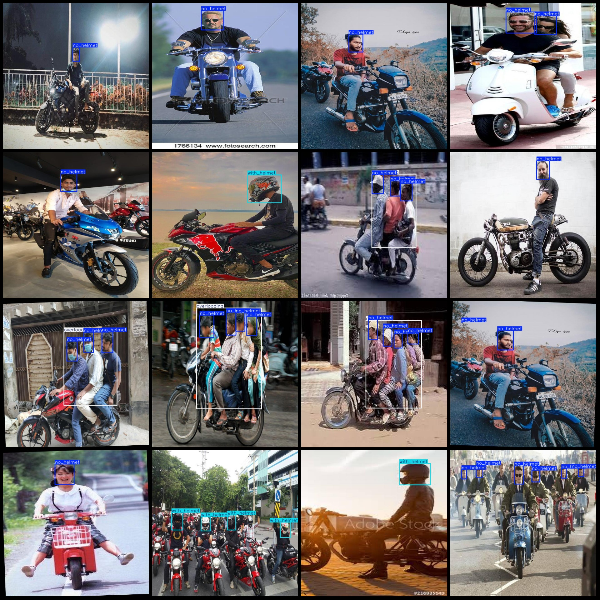
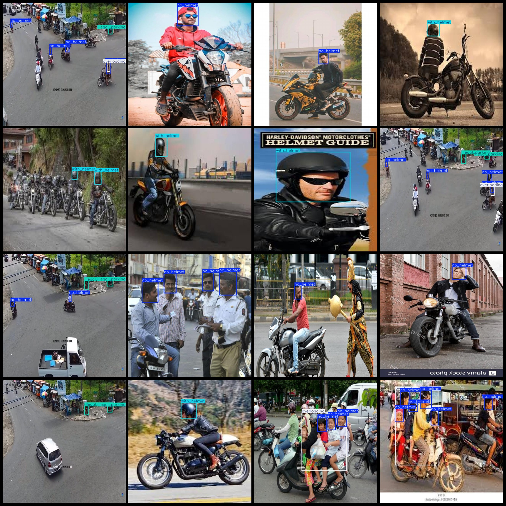

# Motorcycle and Electric Vehicle Helmet Wear Detection Data Set - Pascal VOC + YOLO format (1677 images, 5 categories)

Dataset format: Pascal VOC format plus YOLO format (txt files without split paths, only containing jpg images along with corresponding VOC format xml files and YOLO format txt files).

Number of images (jpg file count): 1667
Number of annotations (xml file count): 1667
Number of annotations (txt file count): 1667
Number of annotation categories: 5
Annotation category names (note that the order in YOLO format does not correspond to this, but is based on the labels folder's 'classes.txt'): ["driving_wrong_direction", "illegal_parking", "no_helmet", "overloading", "with_helmet"]
Number of bounding box instances per category:
- driving_wrong_direction (reversed driving) = 4
- illegal_parking (illegal parking) = 364
- no_helmet (no helmet) = 2704
- overloading (overloaded) = 511
- with_helmet (helmet worn) = 513
Total number of bounding boxes: 4096
Image resolution: 640x640
Annotation tool used: labelImg
Annotation rules: draw a rectangular bounding box around each class
Important note: No warranty given regarding the accuracy of the trained model or weight files
Special declaration: This dataset does not guarantee any accuracy of the trained models or weight files
Image preview:

## Images

Here is a pay link on Stripe ( https://buy.stripe.com/3cs8yP7sY87d0vu9AB ). Please contact me lonlonago@foxmail.com after funding $89, and I will send you a complete data files , thank you!

